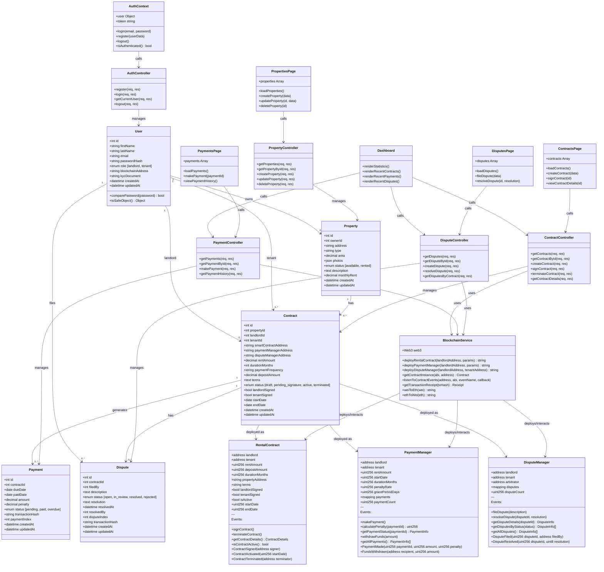

# Diagramme de Classes - Système de Gestion Locative Blockchain

Ce diagramme représente l'architecture complète du système avec les modèles de données, les smart contracts, et les services.

## Légende

### Modèles de Données (Backend)
- **User** : Gestion des utilisateurs (propriétaires et locataires)
- **Property** : Gestion des propriétés immobilières
- **Contract** : Contrats de location (off-chain)
- **Payment** : Historique des paiements
- **Dispute** : Gestion des litiges

### Smart Contracts (Blockchain)
- **RentalContract** : Contrat de location intelligent sur la blockchain
- **PaymentManager** : Gestion automatisée des paiements
- **DisputeManager** : Système de résolution des litiges

### Services
- **BlockchainService** : Pont entre le backend et la blockchain
- **Controllers** : Couche de logique métier pour chaque domaine

### Frontend
- **Context** : Gestion de l'état d'authentification
- **Pages** : Composants React pour l'interface utilisateur
