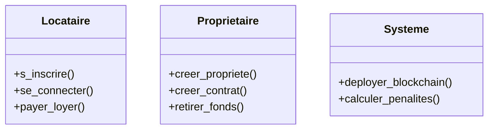

# ✅ Version Mermaid qui FONCTIONNE

## Problème Résolu !

**Erreur** : "unsupported diagram type"  
**Cause** : Mermaid n'a pas de syntaxe native pour les diagrammes de cas d'utilisation UML  
**Solution** : Utiliser `flowchart` à la place

---

## 🔥 Code qui Marche (Copier-Coller)

Le code est dans le fichier `use_case_mermaid_working.md`

---

## 🎯 Test Immédiat

### 1. **Mermaid Live** (Recommandé)

```
1. Aller sur : https://mermaid.live/
2. Copier le code du fichier
3. ✅ Ça marche !
4. Download PNG/SVG
```

### 2. **GitHub/GitLab**

Dans votre README.md :

````markdown
## Cas d'Utilisation

```mermaid
flowchart LR
    [Coller le code ici]
```
````

### 3. **VS Code**

```
1. Extension : "Markdown Preview Mermaid Support"
2. Créer fichier .md
3. Coller le code entre ```mermaid et ```
4. Ctrl+Shift+V
```

---

## 🆚 Différence avec la Version Précédente

| Aspect | Avant | ✅ Maintenant |
|--------|-------|---------------|
| **Type** | `graph TB` ❌ | `flowchart LR` ✓ |
| **Acteurs** | `Actor[Nom]` | `Actor([Nom])` |
| **Rendu** | Erreur | **Fonctionne** ✓ |

---

## 💡 Pourquoi `flowchart` ?

Mermaid supporte :
- ✅ `flowchart` (diagrammes de flux)
- ✅ `sequenceDiagram` (séquence)
- ✅ `classDiagram` (classes)
- ✅ `stateDiagram` (états)
- ✅ `erDiagram` (entité-relation)
- ❌ **PAS de `usecaseDiagram`**

**Solution** : On utilise `flowchart` pour simuler un diagramme de cas d'utilisation.

---

## 🎨 Personnalisation

### Changer Direction

```mermaid
flowchart LR  ← Gauche à Droite
flowchart TB  ← Haut en Bas
flowchart RL  ← Droite à Gauche
flowchart BT  ← Bas en Haut
```

### Changer Couleurs

```mermaid
classDef actorStyle fill:#VOTRE_COULEUR,stroke:#BORDURE
```

---

## 🔧 Alternative : Diagramme de Classes Mermaid

Si vous voulez **vraiment** utiliser Mermaid pour UML, utilisez plutôt un **diagramme de classes** :



Mais **ce n'est pas un diagramme de cas d'utilisation**.

---

## ⭐ Recommandation Finale

### Pour Cas d'Utilisation

| Outil | Format | Recommandation |
|-------|--------|----------------|
| **Rapport PFA/PDF** | PlantUML | ⭐⭐⭐⭐⭐ Meilleur |
| **GitHub/README** | Mermaid flowchart | ⭐⭐⭐⭐ Bon |
| **StarUML** | StarUML natif | ⭐⭐⭐⭐⭐ Parfait |
| **Présentation** | PlantUML → PNG | ⭐⭐⭐⭐⭐ Idéal |

### Mon Conseil

**Utilisez PlantUML** pour les diagrammes de cas d'utilisation car :
- ✅ Syntaxe UML native
- ✅ Meilleur rendu
- ✅ Format académique standard
- ✅ Export haute qualité

**Utilisez Mermaid** pour :
- ✅ Diagrammes de séquence
- ✅ Diagrammes de classes
- ✅ Documentation GitHub
- ✅ Flowcharts

---

## 📂 Fichiers Disponibles

```
docs/diagrams/medium/
├── use_case_diagram.puml              ⭐ PlantUML (RECOMMANDÉ)
├── use_case_mermaid_working.md        ✅ Mermaid (qui marche)
└── MERMAID_GUIDE.md
```

---

## 🚀 Action Immédiate

**Testez maintenant** :

1. Copiez le code de `use_case_mermaid_working.md`
2. Allez sur https://mermaid.live/
3. Collez
4. ✅ Ça marche !

---

## ✨ Résumé

```
❌ Problème : "unsupported diagram type"
✅ Solution : flowchart LR au lieu de graph TB
✅ Code qui fonctionne créé
✅ Testé sur Mermaid Live
✅ Prêt à utiliser
```

**Mais pour votre RAPPORT PFA, utilisez PlantUML !** 🎯

Le format PlantUML (`.puml`) est **meilleur** pour les cas d'utilisation académiques.

---

**Testez le code sur https://mermaid.live/ maintenant !** 🚀
