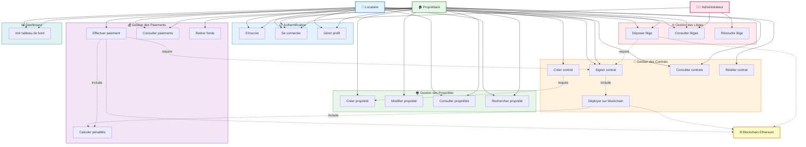

```mermaid
graph TB
    %% Acteurs
    Tenant[👤 Locataire]
    Landlord[🏠 Propriétaire]
    Admin[👨‍💼 Administrateur]
    Blockchain[⛓️ Blockchain Ethereum]
    
    %% Packages avec couleurs
    subgraph Auth["📋 Authentification"]
        UC1[S'inscrire]
        UC2[Se connecter]
        UC3[Gérer profil]
    end
    
    subgraph Properties["🏘️ Gestion des Propriétés"]
        UC4[Créer propriété]
        UC5[Modifier propriété]
        UC6[Consulter propriétés]
        UC7[Rechercher propriété]
    end
    
    subgraph Contracts["📝 Gestion des Contrats"]
        UC8[Créer contrat]
        UC9[Signer contrat]
        UC10[Déployer sur blockchain]
        UC11[Consulter contrats]
        UC12[Résilier contrat]
    end
    
    subgraph Payments["💰 Gestion des Paiements"]
        UC13[Effectuer paiement]
        UC14[Consulter paiements]
        UC15[Calculer pénalités]
        UC16[Retirer fonds]
    end
    
    subgraph Disputes["⚖️ Gestion des Litiges"]
        UC17[Déposer litige]
        UC18[Consulter litiges]
        UC19[Résoudre litige]
    end
    
    subgraph Dashboard["📊 Dashboard"]
        UC20[Voir tableau de bord]
    end
    
    %% Relations Locataire
    Tenant --> UC1
    Tenant --> UC2
    Tenant --> UC3
    Tenant --> UC6
    Tenant --> UC7
    Tenant --> UC9
    Tenant --> UC11
    Tenant --> UC13
    Tenant --> UC14
    Tenant --> UC17
    Tenant --> UC18
    Tenant --> UC20
    
    %% Relations Propriétaire
    Landlord --> UC1
    Landlord --> UC2
    Landlord --> UC3
    Landlord --> UC4
    Landlord --> UC5
    Landlord --> UC6
    Landlord --> UC7
    Landlord --> UC8
    Landlord --> UC9
    Landlord --> UC11
    Landlord --> UC12
    Landlord --> UC14
    Landlord --> UC16
    Landlord --> UC17
    Landlord --> UC18
    Landlord --> UC20
    
    %% Relations Administrateur
    Admin --> UC2
    Admin --> UC18
    Admin --> UC19
    
    %% Relations Blockchain
    UC10 -.-> Blockchain
    UC13 -.-> Blockchain
    UC17 -.-> Blockchain
    
    %% Dépendances entre UC
    UC8 -.->|require| UC4
    UC9 -.->|include| UC10
    UC10 -.->|include| UC15
    UC13 -.->|require| UC9
    UC13 -.->|include| UC15
    UC17 -.->|require| UC9
    
    %% Styles
    style Tenant fill:#e3f2fd,stroke:#1976d2,stroke-width:2px
    style Landlord fill:#e8f5e9,stroke:#388e3c,stroke-width:2px
    style Admin fill:#fce4ec,stroke:#c2185b,stroke-width:2px
    style Blockchain fill:#fff9c4,stroke:#f57f17,stroke-width:2px
    
    style Auth fill:#e3f2fd,stroke:#1976d2
    style Properties fill:#e8f5e9,stroke:#388e3c
    style Contracts fill:#fff3e0,stroke:#f57c00
    style Payments fill:#f3e5f5,stroke:#7b1fa2
    style Disputes fill:#ffebee,stroke:#c62828
    style Dashboard fill:#e0f2f1,stroke:#00796b
```
