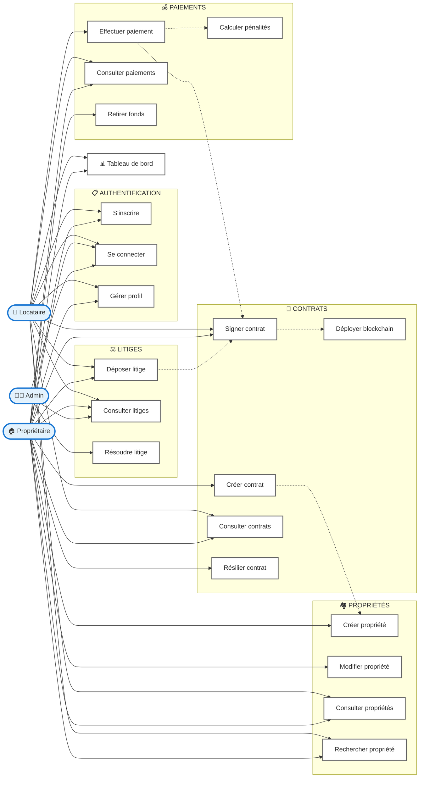

```mermaid
flowchart LR
    %% Acteurs
    Tenant([👤 Locataire])
    Landlord([🏠 Propriétaire])
    Admin([👨‍💼 Admin])
    
    %% Authentification
    subgraph Auth[" 📋 AUTHENTIFICATION "]
        UC1[S'inscrire]
        UC2[Se connecter]
        UC3[Gérer profil]
    end
    
    %% Propriétés
    subgraph Props[" 🏘️ PROPRIÉTÉS "]
        UC4[Créer propriété]
        UC5[Modifier propriété]
        UC6[Consulter propriétés]
        UC7[Rechercher propriété]
    end
    
    %% Contrats
    subgraph Contracts[" 📝 CONTRATS "]
        UC8[Créer contrat]
        UC9[Signer contrat]
        UC10[Déployer blockchain]
        UC11[Consulter contrats]
        UC12[Résilier contrat]
    end
    
    %% Paiements
    subgraph Payments[" 💰 PAIEMENTS "]
        UC13[Effectuer paiement]
        UC14[Consulter paiements]
        UC15[Calculer pénalités]
        UC16[Retirer fonds]
    end
    
    %% Litiges
    subgraph Disputes[" ⚖️ LITIGES "]
        UC17[Déposer litige]
        UC18[Consulter litiges]
        UC19[Résoudre litige]
    end
    
    %% Dashboard
    UC20[📊 Tableau de bord]
    
    %% Relations Locataire
    Tenant --> UC1
    Tenant --> UC2
    Tenant --> UC3
    Tenant --> UC6
    Tenant --> UC7
    Tenant --> UC9
    Tenant --> UC11
    Tenant --> UC13
    Tenant --> UC14
    Tenant --> UC17
    Tenant --> UC18
    Tenant --> UC20
    
    %% Relations Propriétaire
    Landlord --> UC1
    Landlord --> UC2
    Landlord --> UC3
    Landlord --> UC4
    Landlord --> UC5
    Landlord --> UC6
    Landlord --> UC7
    Landlord --> UC8
    Landlord --> UC9
    Landlord --> UC11
    Landlord --> UC12
    Landlord --> UC14
    Landlord --> UC16
    Landlord --> UC17
    Landlord --> UC18
    Landlord --> UC20
    
    %% Relations Admin
    Admin --> UC2
    Admin --> UC18
    Admin --> UC19
    
    %% Dépendances
    UC8 -.-> UC4
    UC9 -.-> UC10
    UC13 -.-> UC9
    UC13 -.-> UC15
    UC17 -.-> UC9
    
    %% Styles
    classDef actorStyle fill:#e3f2fd,stroke:#1976d2,stroke-width:3px
    classDef ucStyle fill:#fff,stroke:#666,stroke-width:2px
    
    class Tenant,Landlord,Admin actorStyle
    class UC1,UC2,UC3,UC4,UC5,UC6,UC7,UC8,UC9,UC10,UC11,UC12,UC13,UC14,UC15,UC16,UC17,UC18,UC19,UC20 ucStyle
```
