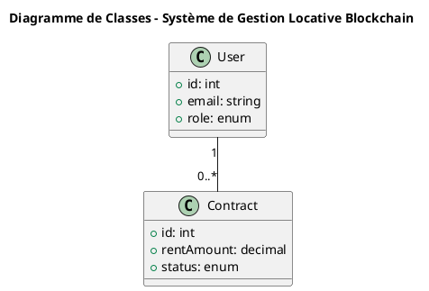

# 🚀 DÉMARRAGE RAPIDE - PlantUML

## ✅ Diagrammes Simplifiés Créés !

J'ai créé **6 diagrammes PlantUML simplifiés** pour votre projet :

### 📁 Fichiers dans `docs/diagrams/plantuml/`

1. **class_diagram.puml** - Diagramme de classes
2. **use_case_diagram.puml** - Cas d'utilisation  
3. **sequence_auth.puml** - Authentification
4. **sequence_contract.puml** - Création contrat
5. **sequence_payment.puml** - Paiement loyer
6. **sequence_dispute.puml** - Gestion litiges

---

## 🎯 Comment Visualiser (3 Méthodes)

### ✅ Méthode 1 : VS Code (RECOMMANDÉ)

**Extension déjà installée !** ✓

**Pour voir un diagramme :**
1. Ouvrir un fichier `.puml` (ex: `class_diagram.puml`) ✓ DÉJÀ OUVERT
2. Appuyer sur **`Alt+D`**
3. Le diagramme apparaît à droite !

**Raccourcis utiles :**
- `Alt+D` = Aperçu du diagramme
- `Ctrl+Shift+P` → "PlantUML: Preview" = Aperçu
- `Ctrl+Shift+P` → "PlantUML: Export" = Exporter en PNG

---

### ✅ Méthode 2 : En Ligne (SANS INSTALLATION)

**Site :** http://www.plantuml.com/plantuml/uml/

**Étapes :**
1. Copier le code d'un fichier `.puml`
2. Coller sur le site
3. ✅ Diagramme affiché instantanément
4. Télécharger en PNG/SVG

**Alternative :** https://www.planttext.com/

---

### ✅ Méthode 3 : Générer Images PNG

**Prérequis :** Java installé

**Vérifier Java :**
```bash
java -version
```

**Si Java n'est pas installé :**
- Télécharger : https://www.oracle.com/java/technologies/downloads/
- OU utiliser la méthode en ligne (plus simple)

**Générer les images :**
```bash
cd docs/diagrams/plantuml

# Télécharger PlantUML (une seule fois)
curl -o plantuml.jar https://repo1.maven.org/maven2/net/sourceforge/plantuml/plantuml/1.2023.13/plantuml-1.2023.13.jar

# Générer tous les PNG
java -jar plantuml.jar *.puml
```

---

## 📊 Aperçu des Diagrammes

### 1. Diagramme de Classes
**Fichier :** `class_diagram.puml`

**Contient :**
- 5 modèles (User, Property, Contract, Payment, Dispute)
- 3 smart contracts (RentalContract, PaymentManager, DisputeManager)
- Relations entre entités

---

### 2. Cas d'Utilisation
**Fichier :** `use_case_diagram.puml`

**Contient :**
- 3 acteurs (Locataire, Propriétaire, Admin)
- 16 cas d'utilisation
- 5 packages (Auth, Propriétés, Contrats, Paiements, Litiges)

---

### 3-6. Diagrammes de Séquence

| Fichier | Description |
|---------|-------------|
| `sequence_auth.puml` | Inscription et connexion |
| `sequence_contract.puml` | Création et signature + déploiement blockchain |
| `sequence_payment.puml` | Paiement avec MetaMask + pénalités |
| `sequence_dispute.puml` | Dépôt et résolution de litige |

---

## 🎓 Pour Votre Rapport

### Option A : Utiliser en Ligne (PLUS SIMPLE)

1. Aller sur : http://www.plantuml.com/plantuml/uml/
2. Copier le code d'un fichier `.puml`
3. Coller dans la zone de texte
4. Cliquer "PNG" pour télécharger
5. Insérer l'image dans Word/PowerPoint

### Option B : VS Code (SI JAVA INSTALLÉ)

1. Ouvrir le fichier `.puml`
2. `Alt+D` pour voir
3. Clic droit sur l'aperçu → "Export Current Diagram"
4. Choisir PNG
5. Utiliser l'image dans votre rapport

---

## 📝 Code Copiable

### Exemple : Diagramme de Classes

Ouvrez `class_diagram.puml` et vous verrez :



**C'est simple et lisible !** ✓

---

## 💡 Avantages PlantUML

✅ **Code simple** - Facile à modifier
✅ **Export facile** - PNG, SVG, PDF
✅ **Qualité professionnelle** - Parfait pour rapports académiques
✅ **Pas de compte requis** - Outil gratuit
✅ **Accepté partout** - Word, LaTeX, PowerPoint

---

## 🔥 Test Immédiat - 30 Secondes !

**MAINTENANT - Faites ceci :**

1. **Dans VS Code** (fichier déjà ouvert) :
   - Appuyez sur `Alt+D`
   - ✅ Voir le diagramme !

2. **OU en ligne** :
   - Allez sur http://www.plantuml.com/plantuml/uml/
   - Copiez le contenu de `class_diagram.puml`
   - Collez
   - ✅ Voir le diagramme !

---

## 📂 Structure Complète

```
pfa/docs/diagrams/
├── plantuml/                    ⭐ NOUVEAUX DIAGRAMMES SIMPLIFIÉS
│   ├── class_diagram.puml       ← Diagramme de classes
│   ├── use_case_diagram.puml    ← Cas d'utilisation
│   ├── sequence_auth.puml       ← Authentification
│   ├── sequence_contract.puml   ← Contrats
│   ├── sequence_payment.puml    ← Paiements
│   ├── sequence_dispute.puml    ← Litiges
│   ├── README.md                ← Guide complet
│   └── QUICK_START.md           ← Ce fichier
│
└── (anciens fichiers Mermaid)   ← Versions détaillées
```

---

## ❓ Questions Fréquentes

**Q : Quel format utiliser pour mon rapport ?**
→ PlantUML ! Plus simple et meilleure qualité d'export

**Q : Je n'ai pas Java, que faire ?**
→ Utilisez la méthode en ligne : http://www.plantuml.com/plantuml/uml/

**Q : Comment modifier un diagramme ?**
→ Éditez le fichier `.puml` directement (c'est du texte simple)

**Q : Quelle taille d'image pour mon rapport ?**
→ PNG avec largeur minimum 1500px

---

## ✨ Prochaines Étapes

1. ✅ Tester `Alt+D` dans VS Code
2. ✅ Exporter un diagramme en PNG
3. ✅ Insérer dans votre rapport Word/LaTeX
4. ✅ Ajouter des légendes (Figure 1, Figure 2...)

---

**Vos diagrammes simplifiés PlantUML sont prêts ! 🎉**

Besoin d'aide ? Consultez `README.md` dans ce dossier.
