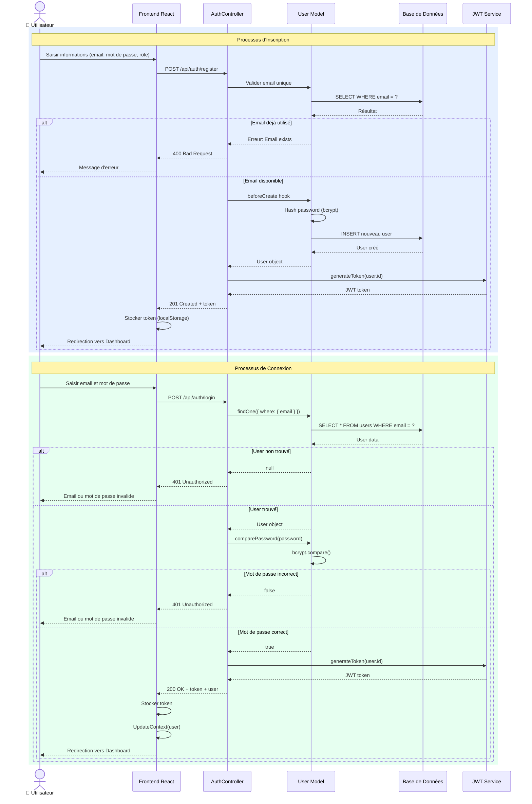
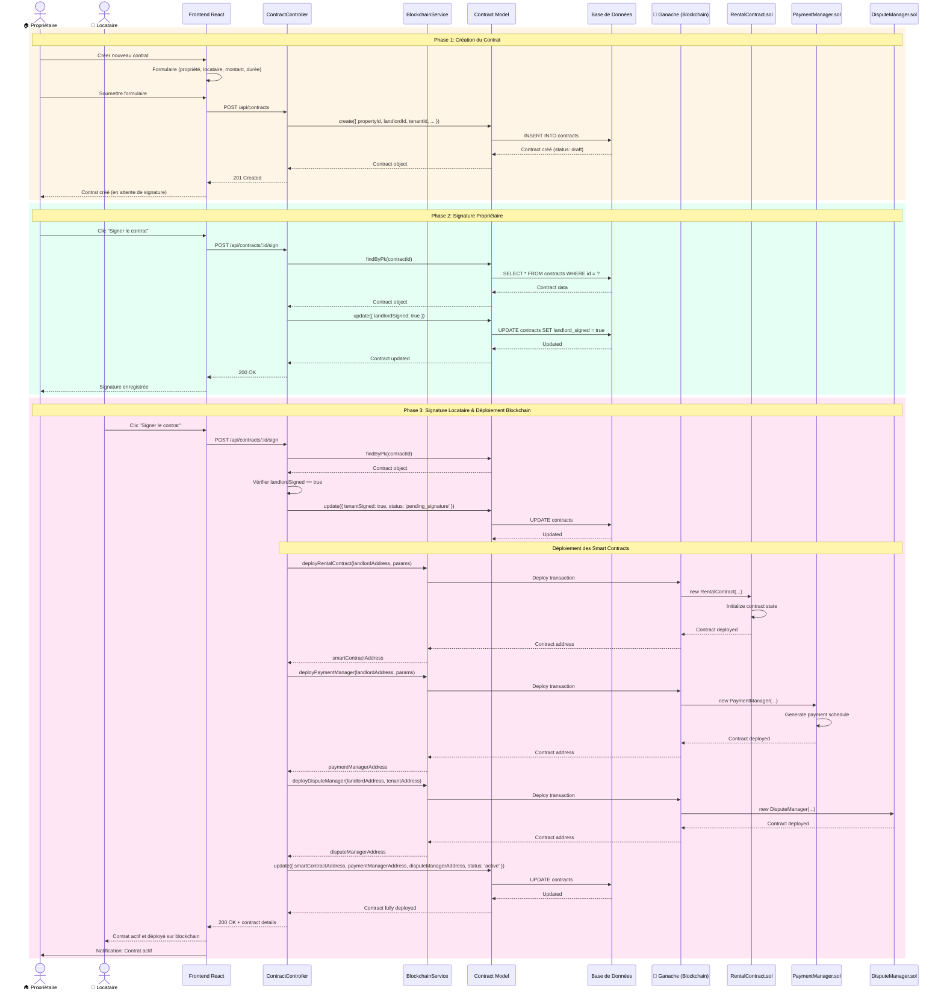
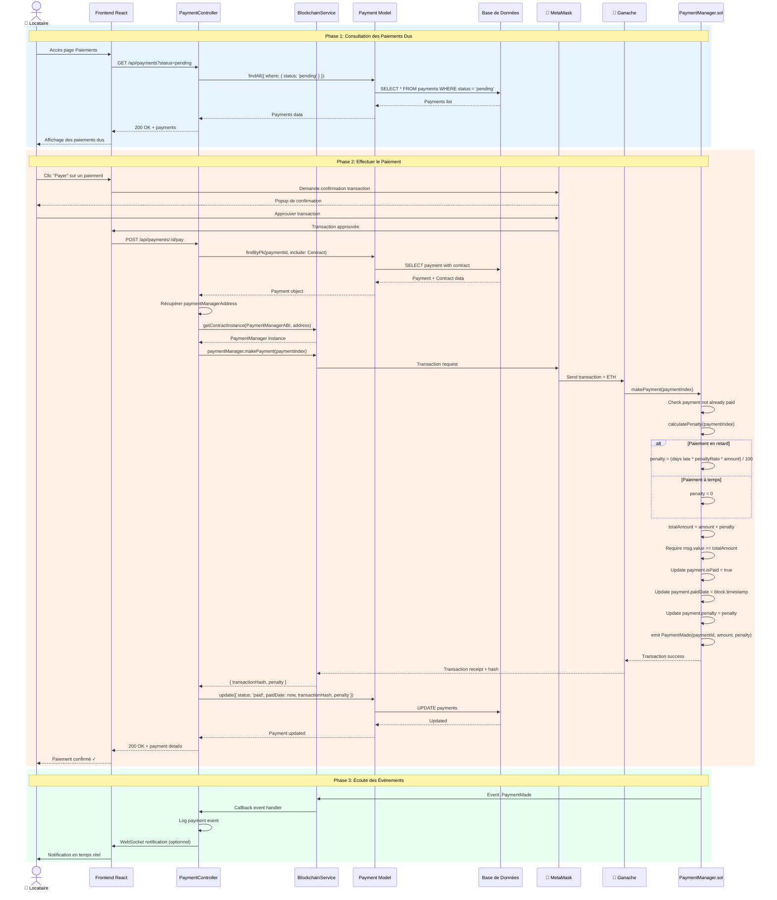
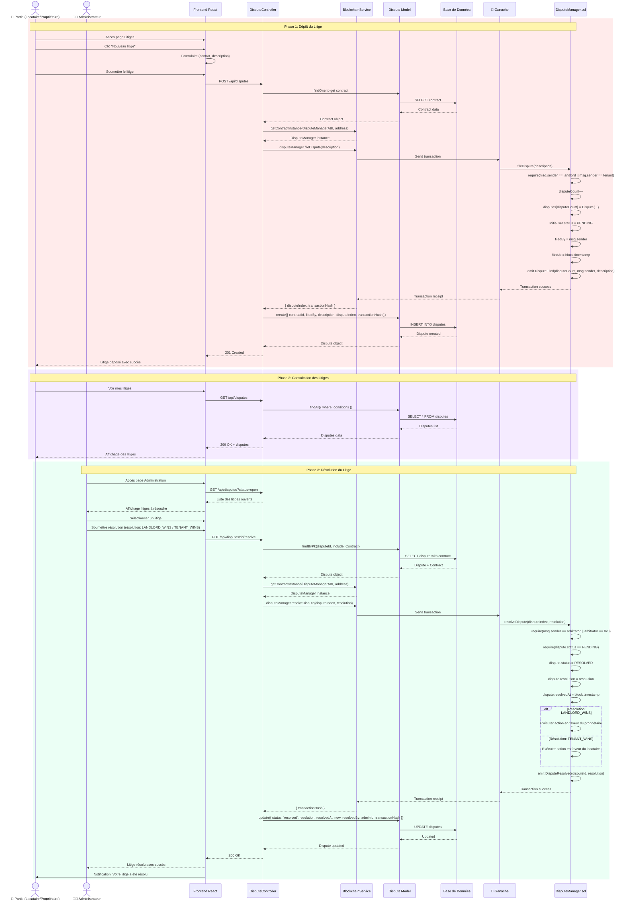
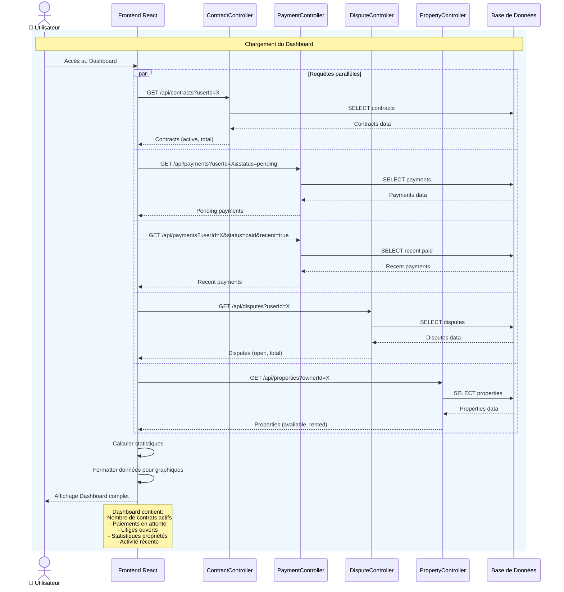

# Diagrammes de Séquence - Système de Gestion Locative Blockchain

Ce document contient les diagrammes de séquence pour les principaux flux du système.

## 1. Séquence : Inscription et Authentification

## 2. Séquence : Création et Signature de Contrat

## 3. Séquence : Paiement de Loyer

## 4. Séquence : Dépôt et Résolution de Litige

## 5. Séquence : Consultation du Dashboard

## Légende

- 🏠 **Propriétaire** : Utilisateur possédant des propriétés
- 👤 **Locataire** : Utilisateur louant une propriété
- 👨‍💼 **Administrateur** : Gestionnaire système pour résolution de litiges
- 🦊 **MetaMask** : Wallet Ethereum pour les transactions
- 🔗 **Ganache** : Blockchain Ethereum locale pour le développement
- **Smart Contracts** : Contrats intelligents déployés sur la blockchain

## Concepts Clés

### Signatures Numériques
- Les signatures sont effectuées côté backend lors de la signature du contrat
- Une fois les deux parties signées, les smart contracts sont automatiquement déployés

### Transactions Blockchain
- Tous les paiements, litiges et actions importantes sont enregistrés sur la blockchain
- Les transactions sont immuables et traçables via leur `transactionHash`

### Synchronisation Off-chain / On-chain
- Les données sont stockées à la fois en base de données (off-chain) et sur la blockchain (on-chain)
- La base de données permet des requêtes rapides et complexes
- La blockchain garantit l'immuabilité et la transparence
