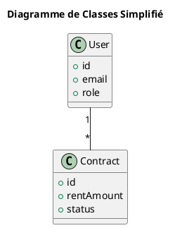

# 📊 Diagrammes Ultra-Simplifiés - PlantUML

## ✅ Version Minimale - Prêts pour Votre Rapport

Ces diagrammes contiennent **uniquement l'essentiel** en moins de 30 lignes chacun.

---

## 📁 Fichiers Créés

```
simple/
├── class.puml          # Diagramme de classes (20 lignes)
├── usecase.puml        # Cas d'utilisation (25 lignes)
├── seq_auth.puml       # Authentification (15 lignes)
├── seq_contract.puml   # Création contrat (20 lignes)
├── seq_payment.puml    # Paiement (15 lignes)
└── README.md           # Ce fichier
```

---

## 🚀 Utilisation Rapide

### Méthode 1 : En Ligne (PLUS SIMPLE)

1. **Aller sur** : http://www.plantuml.com/plantuml/uml/
2. **Copier** le code d'un fichier `.puml`
3. **Coller** sur le site
4. **Télécharger** PNG ou SVG

### Méthode 2 : VS Code

1. **Ouvrir** un fichier `.puml`
2. **Appuyer** sur `Alt+D`
3. **Voir** le diagramme

---

## 📊 Contenu des Diagrammes

### 1. **class.puml** - Classes
- 4 classes principales : User, Property, Contract, Payment
- Relations de base
- **Total : 20 lignes**

### 2. **usecase.puml** - Cas d'Utilisation
- 2 acteurs : Locataire, Propriétaire
- 6 cas d'utilisation essentiels
- **Total : 25 lignes**

### 3. **seq_auth.puml** - Authentification
- Flux de connexion simple
- **Total : 15 lignes**

### 4. **seq_contract.puml** - Contrat
- Création et signature
- Déploiement blockchain
- **Total : 20 lignes**

### 5. **seq_payment.puml** - Paiement
- Paiement loyer simple
- **Total : 15 lignes**

---

## 🎯 Pour Votre Rapport

**Étapes simples :**

1. Allez sur http://www.plantuml.com/plantuml/uml/
2. Copiez le code d'un fichier
3. Téléchargez en PNG
4. Insérez dans Word avec légende

**Exemple de légendes :**
- Figure 1 : Diagramme de classes
- Figure 2 : Diagramme de cas d'utilisation  
- Figure 3 : Séquence d'authentification
- Figure 4 : Séquence de création de contrat
- Figure 5 : Séquence de paiement

---

## ✨ Avantages

✅ **Ultra-courts** - Maximum 25 lignes par diagramme
✅ **Lisibles** - Seulement l'essentiel
✅ **Professionnels** - Parfaits pour rapport académique
✅ **Faciles à modifier** - Code simple

---

## 📝 Exemple de Code

**class.puml (complet) :**


**C'est tout !** Simple et efficace. 🎯

---

## 🔗 Lien Utile

**Visualiseur en ligne** : http://www.plantuml.com/plantuml/uml/

---

**Vos diagrammes sont prêts à utiliser ! 🚀**
