# Diagramme de Cas d'Utilisation - Système de Gestion Locative Blockchain

Ce diagramme illustre toutes les interactions possibles entre les acteurs et le système.

```mermaid
graph TB
    subgraph System["Système de Gestion Locative Blockchain"]
        subgraph Authentication["Authentification"]
            UC1[S'inscrire]
            UC2[Se connecter]
            UC3[Se déconnecter]
            UC4[Gérer son profil]
        end
        
        subgraph PropertyManagement["Gestion des Propriétés"]
            UC5[Créer une propriété]
            UC6[Modifier une propriété]
            UC7[Supprimer une propriété]
            UC8[Consulter les propriétés]
            UC9[Rechercher une propriété]
        end
        
        subgraph ContractManagement["Gestion des Contrats"]
            UC10[Créer un contrat]
            UC11[Signer un contrat]
            UC12[Consulter les contrats]
            UC13[Voir détails du contrat]
            UC14[Résilier un contrat]
            UC15[Déployer smart contract]
        end
        
        subgraph PaymentManagement["Gestion des Paiements"]
            UC16[Effectuer un paiement]
            UC17[Consulter l'historique des paiements]
            UC18[Calculer les pénalités]
            UC19[Retirer des fonds]
            UC20[Consulter les paiements à venir]
        end
        
        subgraph DisputeManagement["Gestion des Litiges"]
            UC21[Déposer un litige]
            UC22[Consulter les litiges]
            UC23[Résoudre un litige]
            UC24[Suivre l'état d'un litige]
        end
        
        subgraph BlockchainOperations["Opérations Blockchain"]
            UC25[Déployer RentalContract]
            UC26[Déployer PaymentManager]
            UC27[Déployer DisputeManager]
            UC28[Écouter les événements blockchain]
            UC29[Vérifier les transactions]
        end
        
        subgraph Notifications["Notifications & Monitoring"]
            UC30[Recevoir notifications de paiement]
            UC31[Recevoir notifications de litige]
            UC32[Tableau de bord statistiques]
        end
    end
    
    %% Acteurs
    Tenant[👤 Locataire]
    Landlord[👥 Propriétaire]
    Admin[👨‍💼 Administrateur]
    Blockchain[⛓️ Blockchain Ethereum]
    System_Auto[🤖 Système Automatisé]
    
    %% Relations Locataire
    Tenant --> UC1
    Tenant --> UC2
    Tenant --> UC3
    Tenant --> UC4
    Tenant --> UC8
    Tenant --> UC9
    Tenant --> UC11
    Tenant --> UC12
    Tenant --> UC13
    Tenant --> UC16
    Tenant --> UC17
    Tenant --> UC20
    Tenant --> UC21
    Tenant --> UC22
    Tenant --> UC24
    Tenant --> UC32
    
    %% Relations Propriétaire
    Landlord --> UC1
    Landlord --> UC2
    Landlord --> UC3
    Landlord --> UC4
    Landlord --> UC5
    Landlord --> UC6
    Landlord --> UC7
    Landlord --> UC8
    Landlord --> UC9
    Landlord --> UC10
    Landlord --> UC11
    Landlord --> UC12
    Landlord --> UC13
    Landlord --> UC14
    Landlord --> UC17
    Landlord --> UC19
    Landlord --> UC21
    Landlord --> UC22
    Landlord --> UC24
    Landlord --> UC32
    
    %% Relations Administrateur
    Admin --> UC23
    Admin --> UC22
    Admin --> UC12
    Admin --> UC8
    
    %% Relations Blockchain
    UC15 -.-> Blockchain
    UC25 -.-> Blockchain
    UC26 -.-> Blockchain
    UC27 -.-> Blockchain
    UC16 -.-> Blockchain
    UC29 -.-> Blockchain
    
    %% Relations Système Automatisé
    System_Auto --> UC18
    System_Auto --> UC28
    System_Auto --> UC30
    System_Auto --> UC31
    
    %% Dépendances entre cas d'utilisation
    UC10 -.->|includes| UC15
    UC15 -.->|includes| UC25
    UC15 -.->|includes| UC26
    UC15 -.->|includes| UC27
    UC16 -.->|includes| UC29
    UC16 -.->|extends| UC18
    UC11 -.->|requires| UC10
    UC14 -.->|requires| UC11
    UC16 -.->|requires| UC11
    UC21 -.->|requires| UC11
    
    style Tenant fill:#e3f2fd
    style Landlord fill:#fff3e0
    style Admin fill:#f3e5f5
    style Blockchain fill:#e8f5e9
    style System_Auto fill:#fce4ec
```

## Description Détaillée des Cas d'Utilisation

### 1. Authentification

| ID | Cas d'Utilisation | Description | Acteurs |
|---|---|---|---|
| UC1 | S'inscrire | Créer un nouveau compte (propriétaire ou locataire) avec KYC | Locataire, Propriétaire |
| UC2 | Se connecter | Authentification avec email et mot de passe | Locataire, Propriétaire, Admin |
| UC3 | Se déconnecter | Terminer la session utilisateur | Tous |
| UC4 | Gérer son profil | Modifier les informations personnelles et l'adresse blockchain | Tous |

### 2. Gestion des Propriétés

| ID | Cas d'Utilisation | Description | Acteurs |
|---|---|---|---|
| UC5 | Créer une propriété | Ajouter une nouvelle propriété avec détails et photos | Propriétaire |
| UC6 | Modifier une propriété | Mettre à jour les informations d'une propriété | Propriétaire |
| UC7 | Supprimer une propriété | Supprimer une propriété non louée | Propriétaire |
| UC8 | Consulter les propriétés | Voir la liste de toutes les propriétés | Tous |
| UC9 | Rechercher une propriété | Filtrer et rechercher des propriétés disponibles | Locataire |

### 3. Gestion des Contrats

| ID | Cas d'Utilisation | Description | Acteurs |
|---|---|---|---|
| UC10 | Créer un contrat | Créer un nouveau contrat de location | Propriétaire |
| UC11 | Signer un contrat | Signer électroniquement le contrat | Propriétaire, Locataire |
| UC12 | Consulter les contrats | Voir tous ses contrats | Propriétaire, Locataire, Admin |
| UC13 | Voir détails du contrat | Consulter les détails complets d'un contrat | Propriétaire, Locataire |
| UC14 | Résilier un contrat | Terminer un contrat actif | Propriétaire |
| UC15 | Déployer smart contract | Déployer les smart contracts sur la blockchain | Système |

### 4. Gestion des Paiements

| ID | Cas d'Utilisation | Description | Acteurs |
|---|---|---|---|
| UC16 | Effectuer un paiement | Payer le loyer via la blockchain | Locataire |
| UC17 | Consulter l'historique des paiements | Voir l'historique complet des paiements | Propriétaire, Locataire |
| UC18 | Calculer les pénalités | Calculer automatiquement les pénalités de retard | Système |
| UC19 | Retirer des fonds | Retirer les loyers collectés | Propriétaire |
| UC20 | Consulter les paiements à venir | Voir les prochains paiements dus | Locataire |

### 5. Gestion des Litiges

| ID | Cas d'Utilisation | Description | Acteurs |
|---|---|---|---|
| UC21 | Déposer un litige | Créer un nouveau litige | Propriétaire, Locataire |
| UC22 | Consulter les litiges | Voir tous les litiges | Tous |
| UC23 | Résoudre un litige | Arbitrer et résoudre un litige | Administrateur |
| UC24 | Suivre l'état d'un litige | Vérifier le statut d'un litige | Propriétaire, Locataire |

### 6. Opérations Blockchain

| ID | Cas d'Utilisation | Description | Acteurs |
|---|---|---|---|
| UC25 | Déployer RentalContract | Déployer le contrat de location sur Ethereum | Système |
| UC26 | Déployer PaymentManager | Déployer le gestionnaire de paiements | Système |
| UC27 | Déployer DisputeManager | Déployer le gestionnaire de litiges | Système |
| UC28 | Écouter les événements blockchain | Monitorer les événements de la blockchain | Système |
| UC29 | Vérifier les transactions | Vérifier la confirmation des transactions | Système |

### 7. Notifications & Monitoring

| ID | Cas d'Utilisation | Description | Acteurs |
|---|---|---|---|
| UC30 | Recevoir notifications de paiement | Alertes pour paiements dus/reçus | Système |
| UC31 | Recevoir notifications de litige | Alertes pour nouveaux litiges | Système |
| UC32 | Tableau de bord statistiques | Voir les statistiques et métriques | Propriétaire, Locataire |

## Flux Principaux

### Flux 1 : Location d'une Propriété
1. Propriétaire crée une propriété (UC5)
2. Locataire recherche une propriété (UC9)
3. Propriétaire crée un contrat (UC10)
4. Les deux parties signent le contrat (UC11)
5. Smart contracts sont déployés automatiquement (UC15, UC25, UC26, UC27)

### Flux 2 : Paiement du Loyer
1. Locataire consulte les paiements à venir (UC20)
2. Locataire effectue un paiement (UC16)
3. Système vérifie la transaction (UC29)
4. Si retard : système calcule les pénalités (UC18)
5. Propriétaire peut retirer les fonds (UC19)

### Flux 3 : Résolution d'un Litige
1. Une partie dépose un litige (UC21)
2. Système enregistre sur la blockchain
3. Les parties suivent l'état (UC24)
4. Administrateur résout le litige (UC23)
5. Résolution enregistrée sur la blockchain
